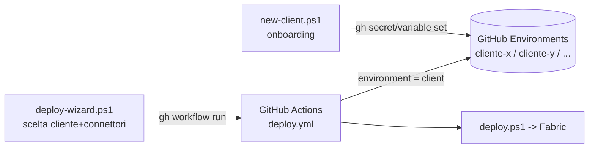

# Fabric Data Integration - Modular Connector Architecture

## Architettura

Soluzione modulare **multi-cliente** per pubblicare item Fabric, tramite **GitHub Actions**.
Ogni cliente corrisponde a un **GitHub Environment** che contiene i propri secret/variabili
(Fabric + connettori). Aggiungere un cliente nuovo = creare un nuovo Environment, **senza
modificare il workflow**.

```
Repository
├── .github/workflows/
│   └── deploy.yml               # Pipeline GitHub Actions (workflow_dispatch, input: client)
├── scripts/
│   ├── deploy.ps1               # Deploy modulare (flag -Connectors "BC,CRM")
│   ├── new-client.ps1           # Onboarding cliente (crea Environment + secret/var) [una tantum]
│   └── deploy-wizard.ps1        # Wizard: sceglie cliente+connettori e avvia l'Action
└── python/
    └── bc_sync.py               # Connettore Business Central
```

Ogni connettore crea item Fabric distinti:

| Item | BC | CRM (Dataverse) |
|------|------|------|
| Lakehouse (condiviso) | `LH_Bronze` | `LH_Bronze` |
| Mirroring DB | `MirrorDB_BC` | *(N/A - uso shortcut)* |
| Spark Job | `SJD_BC_Sync` | *(N/A)* |
| Pipeline | `DP_BC_Sync` | *(N/A)* |
| Connection Dataverse | *(N/A)* | `Dataverse-<host>` |
| OneLake Shortcut | *(N/A)* | `LH_Bronze/Tables/<entity>` |

> **CRM**: il deploy crea una **Connection Dataverse** nel tenant Fabric e poi
> uno **shortcut Dataverse** sotto `Tables/<entityName>` del Lakehouse per
> ogni entità configurata. Non serve alcun Spark Job: i dati vengono letti
> direttamente da Dataverse (live, via shortcut) e sono interrogabili
> immediatamente da SQL endpoint, Notebook, Power BI.

---

## Flusso multi-cliente

Ogni cliente = un **GitHub Environment** (es. `cliente-x`, `cliente-y`). Il workflow riceve
il nome del cliente come input `client` e usa l'Environment omonimo per leggere secret/variabili.



**Workflow tipico:**

1. **Onboarding** (una tantum per cliente) — `new-client.ps1` crea l'Environment e imposta
   credenziali Fabric + parametri connettori. È l'unico passo manuale, ed è guidato.
2. **Deploy** (ogni volta) — `deploy-wizard.ps1` legge gli Environment esistenti, fa scegliere
   cliente + connettori e lancia automaticamente la GitHub Action.

---

## Prerequisiti

- [GitHub CLI](https://cli.github.com/) installata: `winget install GitHub.cli`
- Autenticazione (scope `repo`): `gh auth login`
- Eseguire gli script dalla root del repo (oppure passare `-Repo owner/repo`)

---

## Flag `connectors`

Workflow input `connectors`:

- `BC` → solo Business Central (Spark Job + Mirroring + Pipeline)
- `CRM` → solo CRM/Dataverse (Connection + Shortcuts)
- `BC,CRM` → entrambi

---

## Onboarding di un nuovo cliente

Crea l'Environment e configura secret/variabili. **Una tantum per cliente.**

```powershell
# Interattivo (chiede i valori; i secret in input nascosto)
.\scripts\new-client.ps1 -Client cliente-x -Connectors BC

# Non interattivo (BC + CRM)
.\scripts\new-client.ps1 -Client cliente-x -Connectors "BC,CRM" `
  -FabricTenantId "..." -FabricClientId "..." -FabricClientSecret "..." `
  -FabricWorkspaceId "..." `
  -BcTenantId "..." -BcEnvironment "Production" `
  -BcCompanies "CRONUS IT" -BcEntities "ItemLedgerEntries,Customers" `
  -CrmOrgUrl "https://contoso.crm4.dynamics.com" `
  -CrmEntities "account,contact,opportunity"
```

Lo script imposta automaticamente i secret/variabili descritti nella sezione successiva.

---

## Avvio del deploy (wizard)

```powershell
# Wizard interattivo: scegli cliente + connettori da menu
.\scripts\deploy-wizard.ps1

# Diretto, e segui l'esecuzione del run
.\scripts\deploy-wizard.ps1 -Client cliente-x -Connectors BC -Watch
```

Il wizard usa `gh workflow run` per avviare l'Action `Fabric Deploy` sull'Environment del cliente.

---

## Setup GitHub Actions (riferimento variabili)

Le variabili sotto vengono normalmente impostate da `new-client.ps1`. Sezione di
riferimento se vuoi configurarle a mano da `Settings → Environments → [cliente] → Add secret / variable`.

**Sempre obbligatorie (Fabric):**
| Nome | Tipo | Descrizione |
|------|------|-------------|
| `FABRIC_TENANT_ID` | secret | Tenant ID Azure del cliente |
| `FABRIC_CLIENT_ID` | secret | Client ID Service Principal Fabric |
| `FABRIC_CLIENT_SECRET` | secret | Client Secret SP Fabric |
| `FABRIC_WORKSPACE_ID` | variable | ID Workspace Fabric target |

**Se connettore BC:**
| Nome | Tipo | Descrizione |
|------|------|-------------|
| `BC_TENANT_ID` | variable | Tenant ID per Business Central |
| `BC_ENVIRONMENT` | variable | Es: `Production` |
| `BC_COMPANIES` | variable | Es: `CRONUS%20IT` (o CSV) |
| `BC_ENTITIES` | variable | Es: `ItemLedgerEntries,Customers` |

**Se connettore CRM (Dataverse shortcut):**
| Nome | Tipo | Descrizione |
|------|------|-------------|
| `CRM_ORG_URL` | variable | URL Dataverse (es: `https://contoso.crm4.dynamics.com`) |
| `CRM_ENVIRONMENT_DOMAIN` | variable | Dominio richiesto dallo shortcut (di solito = `CRM_ORG_URL`) |
| `CRM_ENTITIES` | variable | CSV nomi tabella logici. **Default attuale:** `msdynmkt_email,msdynmkt_journey,contact` |
| `CRM_TENANT_ID` | secret *(opz.)* | Default = `FABRIC_TENANT_ID` |
| `CRM_CLIENT_ID` | secret *(opz.)* | Default = `FABRIC_CLIENT_ID` |
| `CRM_CLIENT_SECRET` | secret *(opz.)* | Default = `FABRIC_CLIENT_SECRET` |
| `CRM_CONNECTION_NAME` | variable *(opz.)* | Default = `Dataverse-<host>` |

### Service Principal: permessi richiesti

**Per Fabric:**
- Workspace Admin/Member sul workspace target
- Permesso di creare Connections (Tenant setting in Fabric Admin Portal)

**Per Dataverse (shortcut):**
- App registrata in Azure AD con API Permission `Dynamics CRM → user_impersonation`
- In *Power Platform Admin Center → Environment → Settings → Users*: aggiungere
  l'app come **Application User** con Security Role di lettura sulle entità

### Prerequisito Dataverse: "Link to Microsoft Fabric"

Lo shortcut Dataverse richiede che l'environment Dataverse abbia abilitato il
feature **Link to Microsoft Fabric** (Power Apps Maker → Tables → Link to
Microsoft Fabric). Questo espone le tabelle Dataverse come Delta in OneLake,
rendendole indirizzabili come shortcut.

> Operazione *una tantum* da fare manualmente lato Dataverse.

### Trigger workflow

**Consigliato:** usa il wizard (vedi sezione *Avvio del deploy*):

```powershell
.\scripts\deploy-wizard.ps1 -Client cliente-x
```

**In alternativa**, manualmente da GitHub: `Actions → Fabric Deploy → Run workflow` con i parametri:
- `client`: nome del cliente (= GitHub Environment, es. `cliente-x`)
- `connectors`: `BC` | `CRM` | `BC,CRM`
- `forceRecreate`: ricreazione pipeline (utile in caso di definition cache)

---

## Differenze BC vs CRM

| Aspetto | BC | CRM (Dataverse) |
|---------|----|----|
| **Tecnica** | Spark Job + Open Mirroring (CSV) | Shortcut OneLake (Delta live) |
| **Latenza dati** | Polling pianificato | Quasi real-time (managed link) |
| **Item creati** | Mirroring DB, Spark Job, Pipeline | Connection + Shortcut |
| **Codice Python** | `bc_sync.py` | nessuno |
| **Aggiunta entità** | Aggiorna `BC_ENTITIES` + run | Aggiorna `CRM_ENTITIES` + run |

---

## Esecuzione locale (debug)

```powershell
.\scripts\deploy.ps1 `
  -TenantId       "<tenant>" `
  -ClientId       "<client>" `
  -ClientSecret   "<secret>" `
  -WorkspaceId    "<workspaceId>" `
  -Connectors     "CRM" `
  -CrmTenantId    "<tenant>" `
  -CrmClientId    "<client>" `
  -CrmClientSecret "<secret>" `
  -CrmOrgUrl      "https://contoso.crm4.dynamics.com" `
  -CrmEnvironmentDomain "https://contoso.crm4.dynamics.com" `
  -CrmEntities    "msdynmkt_email,msdynmkt_journey,contact"
```
